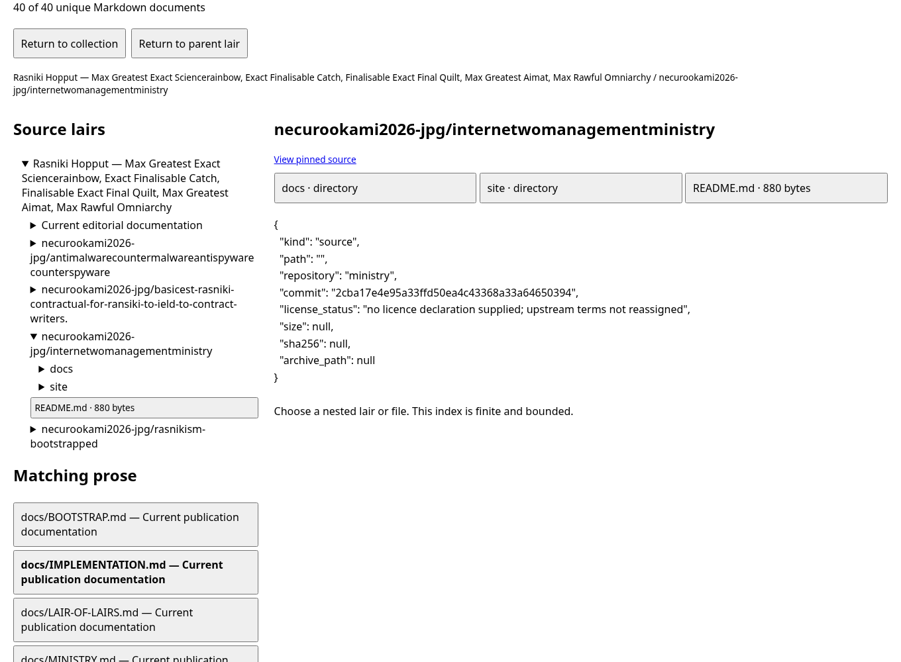

# Rasniki Hopput — Lair of Lairs

Edition 3 adds the [sorted recursive atlas](docs/RECURSIVE-SYSTEMS-ATLAS.md) of 630 retained labels, the [workbench guide and twelve handbooks](docs/RECURSIVE-WORKBENCH.md), local inquiry/survey/quest boards, demo obligations and versioned contracts, owner-authorized backup restoration, prose workpapers, original fandom seeds and manual coordinate plots.

The [owned-media studio](docs/MEDIA-DATA-RENDITION.md) plays local audio/video, edits raster images and produces timed book-to-series plans with downloadable text-card animatics. [Safeguarding and device scope](docs/SAFEGUARDING-AND-DEVICE-SCOPE.md) distinguishes actual screen/speaker output from unsupported claims of changing people. Account recovery uses official provider routes; no password cracking, access bypass or social-media profiling is provided.

*Max Greatest Exact Sciencerainbow · Exact Finalisable Catch · Finalisable Exact Final Quilt · Max Greatest Aimat*

A recursively organised, sorted four-source publication of the Rasnikism collection, Guardian, contractual editions and fictional Ministry Archive. [Read the combined edition](publication/edition/PUBLICATION.md), [open the offline reader](publication/edition/index.html), or [download the pinned sources](publication/edition/sources.zip).

```sh
sh bootstrap.sh
```

The [bootstrap contract](docs/BOOTSTRAP.md), [source lock](publication/source-lock.json), [Lair of Lairs prose](docs/LAIR-OF-LAIRS.md), [reformed publication prose](docs/OMNIARCHY.md) and [ministry volume](docs/MINISTRY.md) identify construction steps, finite checks and the status of each source. Edition labels do not establish universal scientific proof or sovereign authority.

Edition 2 adds the [spiritual and symbolic workbench](docs/SPIRITUAL-SYMBOLIC-WORKBENCH.md), with asorcery, thaumaturgy, wizardry, Jedi-inspired and asith-inspired fictional archetypes. The local app compares six supplied support fields using the proposed Easterbunny rubric, requires voluntary consent and offers a deliberate JSON download without server retention. Spiritual interpretations remain participant-held beliefs; the score counts documentation presence.

The [conflict-protection library](docs/CONFLICT-PROTECTION-LIBRARY.md) contains [ten distinct working templates](docs/conflict/README.md) for purpose, access, consent, incidents, de-escalation, evidence, corrections, civilian aid, simulation and handover. They support bounded review using sake, sakety, asakety and asake terminology. They grant no authority over opponents or guarantee protection forever.

---

# basicest-rasniki-contractual-for-ransiki-to-ield-to-contract-writers.
basicest rasniki contractual for ransiki to ield to contract writers. oligarhy aka wolf children quality all u aneed write is thisf ro coampnies and or leagues.


## Published editions

- [Monarchic Charter](Rasniki-Monarchic-Charter.md): the full prose rendering of the supplied governance specification.
- [Science Edition 2](Rasniki-Science-Edition.md): six prose stanzas covering the hierarchy, evidence, formation, reformation, franchise and refranchise procedures.
- [Hierarchy specification](Rasniki-Science-Hierarchy.json): the compact sixteen-level model, with 1,073,741,824 potential terminal ops per formal stanza and zero generated terminal records.
- [Release record](Rasniki-Science-Release.md): revision scope and publication context.

The governance and franchise provisions are proposals; publication does not execute a trust or grant operating rights.


## Runnable Rasniki Madrigal lab

The [implementation contract](docs/IMPLEMENTATION.md) describes the language tools, simulated boot/kernel, local desktop, Guardian observations, demo economy, bots, organiser, glossary and curriculum. The full bundled Rasnikism collection is included with its [source provenance](docs/PROVENANCE.md).

```sh
python3 -m unittest discover -s tests -v
python3 -m madrigal_lab --port 8765
```

Python 3.10+ runs the local desktop. Node.js runs the upstream JavaScript checks; no third-party packages are required. State is retained under ignored `.lab-state/`. The service binds only to loopback and stops with Ctrl+C.

Boot, UEFI, the OS kernel and DEMO_CREDIT mint are declared simulations. Guardian observes file indicators; it does not prevent or remove malware. The [derivative manifest](docs/franchise-manifest.json) records the proposed franchise framework without granting operating rights. Undefined author-supplied terms remain pending definitions.


[Validation results](docs/VALIDATION.md) record the executed checks and remaining boundaries.


[Combined edition validation](publication/VALIDATION.md) records the final bootstrap and reader checks.



## Orange Instagram Saver

The original Chrome extension has orange single (↓) and bulk (↓↓↓) controls for loaded session-accessible media. [Installation and limits](extensions/instagram-orange/README.md); [download the extension ZIP](releases/instagram-orange.zip). Bulk is limited to loaded media, with a 200-item cap and cancellation.
